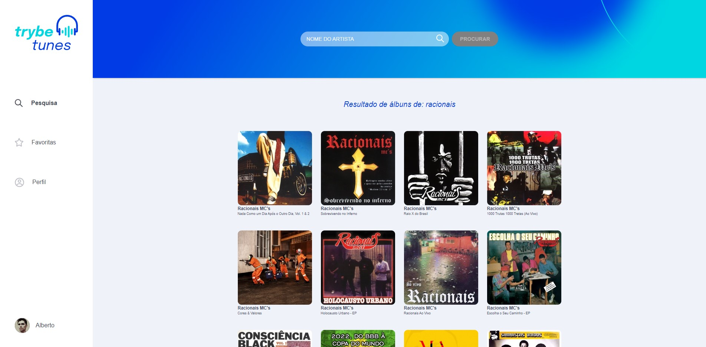

# TrybeTunes



## Descrição

O TrybeTunes é um aplicativo em que você pode cadastrar-se, pesquisar e favoritar suas músicas favoritas. Explore um vasto catálogo de músicas e crie sua própria lista de favoritas!

## Tecnologias Utilizadas

O projeto foi desenvolvido utilizando as seguintes tecnologias:

- React
- React Router

## Funcionalidades

- Cadastro de usuário para acessar recursos personalizados.
- Pesquisa de músicas disponíveis.
- Adicionar músicas aos favoritos para acesso rápido e fácil.

## Pré-requisitos

Certifique-se de que você tenha a versão 16 ou 18 do Node.js instalada em seu sistema antes de executar o projeto.

## Como Executar o Projeto

Siga os passos abaixo para executar o projeto em sua máquina local:

1. Faça o clone deste repositório em um diretório de sua preferência utilizando o seguinte comando:

```
git clone https://github.com/seu-usuario/trybe-tunes.git
```

2. Navegue até o diretório do projeto:

```
cd trybe-tunes
```

3. Instale as dependências necessárias executando o seguinte comando:

```
npm install
```

4. Com todas as dependências instaladas, agora você pode iniciar o aplicativo usando o seguinte comando:

```
npm start
```

O aplicativo será iniciado em modo de desenvolvimento e estará acessível em [http://localhost:3000](http://localhost:3000).

## Como Executar os Testes

Para executar os testes, você pode usar o seguinte comando:

```
npm test
```

Isso iniciará a execução dos testes automatizados e você verá os resultados no console.

## Estrutura do Projeto

Aqui está uma breve visão geral da estrutura de pastas do projeto:

```
trybe-tunes/
  ├── src/
  │   ├── components/
  │   ├── pages/
  │   ├── services/
  │   ├── utils/
  │   ├── validate/
  │   ├── App.js
  │   ├── index.js
  │   └── ...
  ├── public/
  │   ├── index.html
  │   └── ...
  ├── package.json
  ├── README.md
  └── ...
```

- A pasta `src` contém todos os arquivos do código-fonte do aplicativo.
- `components` e `pages` contêm os componentes React utilizados no aplicativo.
- `services` contém os arquivos que lidam com a comunicação com a API.
- `utils` contém funções auxiliares utilizadas no projeto.
- `validate` contém funções de validação de formulários.
- `App.js` é o componente raiz do aplicativo que controla a estrutura geral da aplicação.
- `index.js` é o ponto de entrada do aplicativo, onde ele é renderizado na página HTML.
- A pasta `public` contém arquivos estáticos, como o arquivo `index.html`, que é a página base do aplicativo.

Sinta-se à vontade para explorar e modificar o código conforme suas necessidades.
